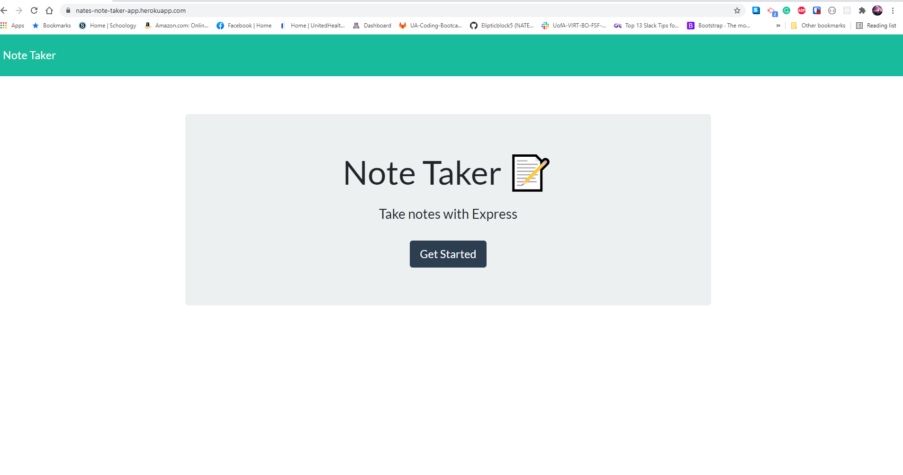
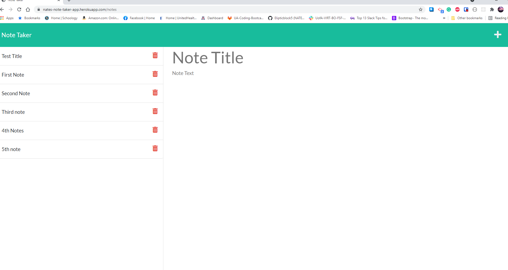

# NoteTaker

nates-note-taker-app

## Licensing:

## Description

An app that uses Express.JS to create notes and delete notes for task mangement.

## Website

https://nates-note-taker-app.herokuapp.com/

## SreenShots

## Table of Contents

- [License](#License)

- [Technology](#Technology)

- [Questions](#Questions)

### License

ISC

### Technology

- HTML
- CSS
- JavaScript
- JSON
- Node.js
- Express.js
- Heroku

## Questions

- Please feel free to email me at nbjohnson@gmail.com
- Find me on Github at [EliptickBlock5](https://github.com/Elipticblock5)
